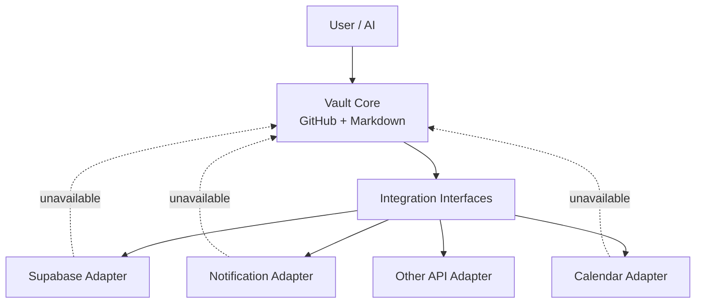

# Partner Vault Lite 技術設計書

## 1. 目的

本設計書は、個人が AI と継続的に情報・判断・タスク・知識を扱うための、**小さく始められる汎用 Vault** の恒久的な設計境界を定義する。

対象は、既存の高度な Personal Vault をそのまま複製することではない。既存 Vault から有効な設計思想だけを抽出し、公開されている一般的なナレッジ管理パターンと組み合わせ、次を満たす軽量構成とする。

- GitHub と Markdown だけでも成立する
- AI が迷わず必要情報へ到達できる
- 正本、履歴、TODO、未確認事項、AI解釈を混在させない
- 機能追加時も Core を外部サービスへ密結合させない
- Supabase、通知、外部 API 等を後付けできる
- 個人ごとの Vault を分離し、他人の個人情報へ横断アクセスさせない
- 将来、汎用 Skill / Rule / Template を別の共有モジュールへ昇格できる

本設計書は実装手順書ではない。現在の SHA、PR、進捗、実行コマンド、Secret、実環境 ID は正本対象にしない。

---

## 2. 対象範囲

### 2.1 対象

- Markdown Vault の基本ディレクトリ構造
- AI Agent が Vault を利用するための最小ルーティング
- 情報の正本ルール
- Skill / Template の配置方針
- 外部サービスとの責務境界
- Supabase を導入する場合の役割
- 個人情報と Secret の境界
- 将来の Shared Core への昇格方針
- 障害時に Core を維持するための縮退方針

### 2.2 対象外

初期設計では次を必須機能にしない。

- 高度な Control Plane
- Supabase 上での AGENT / Workflow 本文正本化
- Vector Database / Embedding 検索
- 自律 Agent の常時実行
- 複雑なジョブキュー
- VPS 常駐 Worker
- 高度な評価・Telemetry 基盤
- 複数 Agent の分散ロック
- Personal Vault 固有の運用ルールの全面移植
- 個人間でのデータ共有機構

これらは実利用で必要性が確認された場合のみ追加する。

---

## 3. 設計原則

### 3.1 Markdown-first

人間と AI が意味を理解するための主要情報は Markdown を第一選択とする。

```text
GitHub / Markdown
    = 人間と AI が読む恒久情報の正本

Supabase 等
    = 機械処理に向く構造化状態
```

外部サービスが停止しても、Vault の主要情報は GitHub 上の Markdown から読める状態を維持する。

### 3.2 Core は外部サービスを要求しない

Core の通常操作は次だけで成立させる。

- Markdown を読む
- Markdown を更新する
- Git で履歴を残す
- Index から必要な文書へ到達する
- 選択された Skill を読む

Supabase、Telegram、Calendar、外部 API 等を利用できないことを理由に、通常の記録・参照・整理を停止しない。

### 3.3 正本を乱立させない

同一責務について `final`、`最新版`、`v2` のような複製を増やさない。

情報は最低限、次の種類を区別する。

- 現在有効な事実・方針
- 決定事項
- 履歴
- TODO
- 未確認事項
- AI の意見・解釈
- 一時情報

現在有効な情報と履歴を同じ本文へ無制限に追記しない。

### 3.4 Progressive Enhancement

最小構成から始め、必要になった機能だけ追加する。

```text
Phase 1: GitHub + Markdown
Phase 2: 最小 Skill / Template
Phase 3: 必要な構造化データのみ Supabase
Phase 4: 通知・定期処理などの Adapter
Phase 5: 実測で有効性が確認された高度機能
```

Phase を進めること自体を目的にしない。

### 3.5 個人 Vault は独立させる

利用者ごとに repository と外部データストアを分離する。

```text
User A
  ├─ GitHub Vault A
  └─ Supabase A (optional)

User B
  ├─ GitHub Vault B
  └─ Supabase B (optional)
```

一方の個人 Vault から他方の個人情報を既定で参照できる構成にはしない。

---

## 4. 推奨ディレクトリ構成

初期構成は次を基準とする。

```text
vault/
├─ AGENTS.md
├─ README.md
├─ vault.config.yml
│
├─ 00_Inbox/
├─ 10_Daily/
├─ 20_Projects/
├─ 30_Areas/
├─ 40_Resources/
├─ 90_Archive/
│
├─ .agents/
│  ├─ SKILLS_INDEX.md
│  └─ skills/
│     ├─ vault-organize/
│     ├─ task-management/
│     └─ research/
│
├─ templates/
│  ├─ project.md
│  ├─ note.md
│  └─ decision.md
│
├─ integrations/
│  ├─ README.md
│  ├─ supabase/
│  ├─ notifications/
│  └─ calendar/
│
└─ docs/
   └─ PARTNER_VAULT_LITE_DESIGN.md
```

ディレクトリは最初から全て実装する必要はない。責務境界として予約し、空ディレクトリ維持のためだけのファイルは原則作成しない。

---

## 5. 各ディレクトリの責務

### `00_Inbox`

未整理情報の一時入口。

長期正本として利用しない。保存先が明確になった情報は適切な正本へ統合する。

### `10_Daily`

日付に紐づく出来事、作業ログ、短期的な状態を保存する。

恒久的な仕様・プロフィール・知識の第一参照先にはしない。

### `20_Projects`

完了条件のある活動を管理する。

各 Project は最低限、目的・現在状態・完了条件・主要な決定への導線を持つ。

### `30_Areas`

終了期限を持たず、継続的に管理する責務を保存する。

例:

- 家計
- 健康
- 仕事
- 家庭
- 学習

### `40_Resources`

再利用可能な知識、調査、手順のうち、Project や Area 固有ではないものを保存する。

### `90_Archive`

現在参照の第一候補ではない完了済み・旧情報を保存する。

Git 履歴で十分な旧版コピーは作成しない。

### `.agents`

AI のルーティングと再利用可能な Skill を保存する。

AI が全 Skill を毎回読む構成にしない。`SKILLS_INDEX.md` で候補を絞り、必要な Skill だけを読む。

### `templates`

利用者が繰り返し作る Markdown の型を保存する。

Template は正本の代替ではなく、新規作成時の初期形だけを提供する。

### `integrations`

外部サービス固有の Adapter を配置する。

Core の責務をここへ逆流させない。

---

## 6. 正本と情報分類

### 6.1 正本の優先順位

対象テーマについて、次の順で第一参照先を決める。

1. 明示的に canonical と定義された文書
2. README / Index から第一参照先として案内される文書
3. 責務が一致する既存文書
4. 新規文書

更新日時が新しいだけで正本と判断しない。

### 6.2 情報分類

| 情報 | 保存先の原則 |
|---|---|
| 現在有効な事実・方針 | 対象テーマの正本 |
| 決定事項 | 正本または Decision 文書 |
| 日々の出来事 | Daily |
| 進行中 Project | Projects |
| 継続責務 | Areas |
| 再利用知識 | Resources |
| 未整理 | Inbox |
| 完了・旧情報 | Archive または Git 履歴 |
| TODO | 関連 Project / Area。機械処理が必要なら Supabase 併用可 |
| 未確認情報 | 正本内の明示セクションまたは Inbox |
| AI 解釈 | 事実と区別して記録 |

---

## 7. AI Agent の最小ルーティング

AI が Vault を扱う際は、全文走査を既定にしない。

基本ルートは次とする。

```text
User Request
   ↓
root AGENTS.md
   ↓
関連 Index / README
   ↓
対象の正本候補
   ↓
必要なら SKILLS_INDEX.md
   ↓
選択された SKILL.md のみ
   ↓
Read / Update
```

### 最小ルール

- 依頼と無関係なディレクトリを全走査しない
- Skill は最大限必要なものだけ読む
- 既存正本を確認してから新規ファイルを作る
- AI の推論を本人確認済みの事実に変換しない
- 本人情報・Secret を外部サービスへ不要に送信しない
- write 後は可能な範囲で同じ対象を read-back する

---

## 8. Skill 設計

初期段階では Skill を増やしすぎない。

推奨する初期 Skill は最大 3〜5 個とする。

### 8.1 `vault-organize`

用途:

- 保存先判断
- 正本への統合
- Inbox 整理
- 重複文書防止

### 8.2 `task-management`

用途:

- TODO 抽出
- Project との関連付け
- 完了条件整理
- 必要時の Supabase task 同期

### 8.3 `research`

用途:

- Web 調査結果の保存
- 出典と AI 解釈の分離
- 一時調査と恒久 Resources の切り分け

### 8.4 Skill 昇格条件

新規 Skill は、単に便利そうという理由で追加しない。

次のいずれかを満たす場合に候補とする。

- 同じ判断・手順が複数回発生した
- 人による実行差が問題になった
- 再利用価値が明確になった
- 通常ルールだけでは抜け漏れが繰り返された

---

## 9. 外部知識の取り込み

ネット上の Vault、PKM、PARA、Agent Memory 等は**参考実装**として扱う。

外部 repository や記事を runtime dependency にしない。

```text
External Knowledge
      ↓ 参考・比較
Design Decision
      ↓ 採用判断
Local Rule / Skill / Template
      ↓
Partner Vault Core
```

### 採用ルール

外部アイデアを採用する場合は次を確認する。

- この Vault の実利用に必要か
- Core の依存を増やさないか
- 情報探索コストを減らすか
- 利用者が理解できるか
- 既存責務と重複しないか
- ライセンス上、コードや文章の再利用が許可されているか

外部 repository の内容を無条件にコピーしない。

---

## 10. Supabase 境界

### 10.1 初期状態

Supabase は **optional** とする。

Supabase project が存在しなくても Vault Core は利用可能でなければならない。

### 10.2 Supabase に向く情報

次のような「機械処理を繰り返す構造化状態」は Supabase 候補とする。

- TODO / task state
- reminder / notification state
- 定期処理の実行状態
- event log
- 軽量 telemetry
- 外部サービス同期状態
- 集計対象となる時系列データ
- 複数クライアントから CRUD するデータ

### 10.3 Markdown に残す情報

次は原則 Markdown 正本とする。

- 本人プロフィールの説明
- Project の目的・方針
- 判断理由
- ナレッジ本文
- 設計書
- 長文メモ
- AI が意味理解するための文脈

### 10.4 二重正本禁止

同一責務を Markdown と Supabase の両方で独立更新しない。

同期する場合は必ず一方を canonical とする。

例:

```text
Task body / task status
  -> Supabase canonical

Project の目的・背景・判断
  -> Markdown canonical

Markdown から task を表示する場合
  -> Supabase の派生 view / snapshot として扱う
```

### 10.5 Supabase 導入判断

次のいずれかが実際に必要になった時点で導入する。

- Markdown だけでは検索・集計が不便
- 自動通知が必要
- 定期処理が必要
- 状態遷移を機械的に保証したい
- 複数サービスから同じ構造化状態を更新したい

「将来使うかもしれない」だけでは導入しない。

---

## 11. Integration Adapter 境界

外部連携は `integrations/` 配下へ閉じ込める。



破線は「利用不能でも Core を停止させない」境界を表す。

### Adapter の原則

- Core 文書から特定 SDK を直接要求しない
- 外部 API の認証情報を Markdown 正本へ書かない
- 外部サービス固有 ID を恒久設計へ埋め込まない
- Adapter 障害時に Markdown の読み書きを壊さない
- Adapter の削除で Core の情報が失われない

---

## 12. Shared Core 構想

個人 Vault で有効性が確認された汎用資産は、将来的に Shared Core へ昇格できる。

```text
                 generic-vault-core
                /        |        \
           Skills      Rules    Templates
              ↑           ↑          ↑
              │ validated reusable assets
              │
     ┌────────┴────────┐
     │                 │
personal-vault    partner-vault
```

### Shared Core に含めてよいもの

- 個人情報を含まない Skill
- 汎用 Template
- 一般的な Markdown schema
- 共通 lint / validation script
- 一般化された運用ルール

### Shared Core に含めないもの

- 本人プロフィール
- 個人の履歴
- 家計・健康・仕事などの実データ
- Secret
- 個人固有の API ID
- 個人特有の判断を一般化していない Rule

### 昇格条件

Shared Core への移動は次を満たす場合だけ行う。

1. 複数 Vault で再利用価値がある
2. 個人固有情報を除去できる
3. 入出力または適用条件を説明できる
4. 元 Vault の存在を要求しない
5. 変更による影響範囲を限定できる

---

## 13. Security / Privacy 境界

### 13.1 Repository visibility

**実データを保存する個人 Vault は private repository を前提とする。**

public repository では、設計書・汎用 Skill・Template 等の個人情報を含まない資産のみ扱う。

### 13.2 Secret

次は Git 管理しない。

- Supabase service role key
- API token
- private key
- password
- OAuth credential
- webhook secret

Secret は利用環境の Secret Store / Environment Variable 等へ保存する。

### 13.3 個人情報

外部 AI・外部 API へ送る情報は、タスク達成に必要な最小範囲とする。

個人情報を含む文書を Shared Core へ昇格しない。

### 13.4 個人間の境界

各 Vault は独立した認証境界を持つ。

共有機能が必要になった場合も、原則は Shared Core の「コード・ルール共有」とし、個人データの相互読み取りは別要件として設計する。

---

## 14. 障害・縮退方針

### GitHub が利用可能 / Supabase が利用不能

Markdown Core の通常利用を継続する。

構造化機能だけ `degraded` とする。

### Supabase が利用可能 / GitHub が利用不能

Supabase の構造化状態は参照できても、Markdown 正本を推測で更新しない。

GitHub 復旧後に正本から再開する。

### Integration が利用不能

通知・同期を停止し、Core を継続する。

### Skill が壊れた / 不明

通常の Markdown 読み書きへ fallback する。

Skill 不在を理由に Vault 全体を停止しない。

---

## 15. Rollback 方針

### Markdown / Rule / Skill

Git 履歴を基本 rollback 手段とする。

### Supabase schema

導入後は migration 管理を行い、破壊的変更は rollback または forward fix 可能な単位に限定する。

### Integration

Adapter を disable / remove しても Core が動作することを維持する。

---

## 16. 主要設計判断

### 判断 A: GitHub + Markdown を Core とする

**理由:**
人間と AI の双方が読みやすく、Git で履歴を管理でき、特定 SaaS 障害に依存しない。

**代替案:**
Supabase-first、Notion-first、Vector DB-first。

**採用しなかった理由:**
初期構成として依存・運用・復旧の複雑性が高い。

**再検討条件:**
Markdown では主要ユースケースの検索・更新性能を満たせないことが実測された場合。

### 判断 B: Supabase は optional Adapter とする

**理由:**
構造化状態には有効だが、Vault の意味情報まで DB 正本にすると初期利用者には複雑すぎる。

**代替案:**
初日から Supabase を必須にする。

**採用しなかった理由:**
利用開始前から障害点と認知負荷を増やすため。

**再検討条件:**
Task、通知、定期処理、状態遷移など DB を使う具体的需要が発生した場合。

### 判断 C: 個人 Vault と Shared Core を分離可能にする

**理由:**
有効な Skill / Rule を再利用しつつ、個人情報を共有しないため。

**代替案:**
一つの巨大 repository に全利用者の Vault を配置する。

**採用しなかった理由:**
権限境界、Secret、誤参照、変更影響が大きくなるため。

**再検討条件:**
複数利用者で同一データを共同編集する要件が明確になった場合。

### 判断 D: 高度な Personal Vault Control Plane は移植しない

**理由:**
高度な運用は既存 Personal Vault の規模・自動化・失敗学習から必要になったものであり、初期の Partner Vault へ持ち込むと過剰設計になる。

**代替案:**
既存 Personal Vault の AGENT / Workflow / Supabase Control Plane を複製する。

**採用しなかった理由:**
依存、保守、理解コスト、障害点が大きく、簡易 Vault の目的に反するため。

**再検討条件:**
実利用で同等の複雑性が必要になり、その効果が運用コストを上回ることが確認された場合。

---

## 17. 非機能要件

### Portability

Git clone と Markdown reader があれば主要情報を参照できること。

### Recoverability

外部サービス障害時でも GitHub 上の Markdown から主要情報を復元できること。

### Understandability

新規利用者が root README / AGENTS から主要ディレクトリと正本ルールを追跡できること。

### Loose Coupling

任意の Integration を削除しても Core の Markdown 読み書きが壊れないこと。

### Privacy

個人 Vault のデータを Shared Core へ自動的に流出させないこと。

---

## 18. 初期導入の完了条件

Partner Vault Lite の Phase 1 は次を満たした時点で完成とする。

- repository が private である
- root `README.md` から Vault の目的と主要ディレクトリを理解できる
- root `AGENTS.md` から AI の最小ルーティングが理解できる
- Inbox / Daily / Projects / Areas / Resources / Archive の責務が定義されている
- 正本・履歴・TODO・未確認・AI 解釈の扱いが定義されている
- Skill は必要最小限で、Index から個別 Skill へ到達できる
- Supabase が存在しなくても通常の Vault 操作が成立する
- Secret が repository に保存されない
- 外部 Integration を削除しても Core が成立する

Supabase の project 作成、task table 作成、通知連携等は Phase 1 完了条件に含めない。

---

## 19. 将来拡張候補

必要性が確認されたものだけ検討する。

- Supabase Task Store
- Reminder / Notification Adapter
- Calendar Adapter
- Telegram / LINE Adapter
- Web clipping / Research ingestion
- 定期 Daily / Weekly maintenance
- Failure learning
- Skill usage telemetry
- Shared Core repository
- Vault schema validation
- AI handoff template
- Read-only family/shared area
- Personal data export / backup

候補に存在するだけでは実装対象としない。

---

## 20. 関連文書

今後、必要になった時だけ次を追加する。

- `README.md` — 利用者向け入口
- `AGENTS.md` — AI 向け最小ルーティング
- `.agents/SKILLS_INDEX.md` — Skill の選択ルール
- `integrations/README.md` — Adapter 境界
- Supabase 導入時の Data / Migration 設計書
- Shared Core を分離する場合の ADR

本設計書自体に実装進捗や運用ログを追記しない。
